# Isabella Oniate-Shopping-List-Assignment
<!DOCTYPE html>
<html>
<body>
<h1>My Shopping List</h1>
<ul> <strong>Dairy</strong> 
<li>Sour Cream</li>  <a href="https://www.heb.com/product-detail/daisy-sour-cream/314023">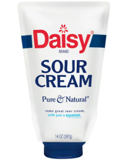</a>
<li>Cheese</li>
  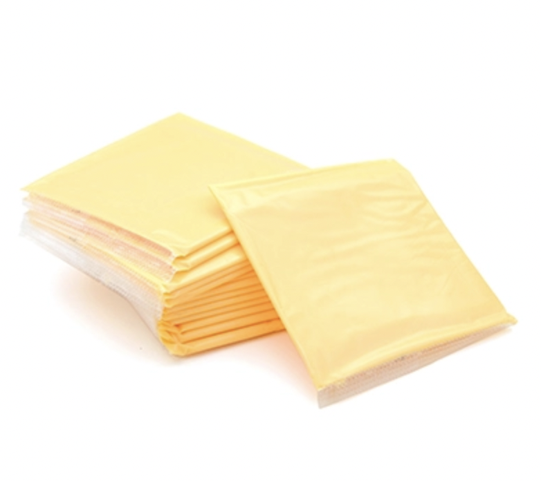
<li>Milk</li>
  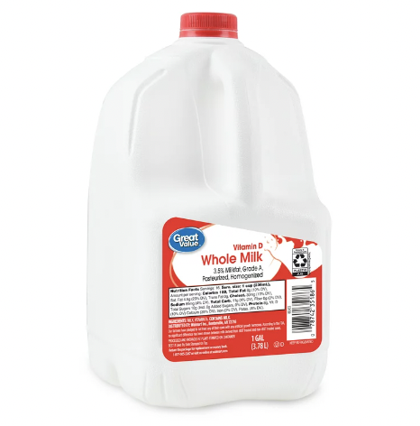
<li>Cream Cheese</li>
  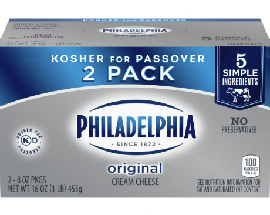
<li>Yogurt</li> </ul>
  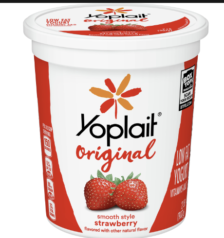
</ul>
<ul> <strong>Snacks</strong>
<li>Gummy Bears <strong>(ONLY THE RED ONES)</strong></li>
   
<li>Potato Chips</li>
   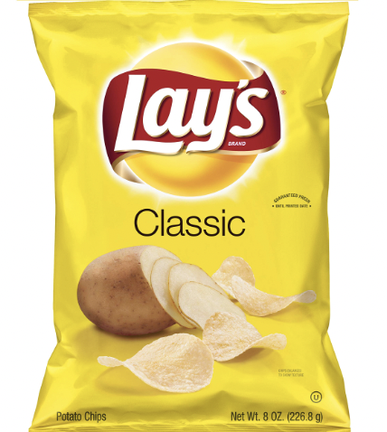
<li>Chocolate Chip Cookies</li>
   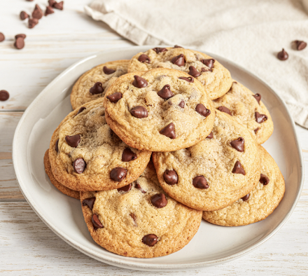
<li>Cracckers</li>
   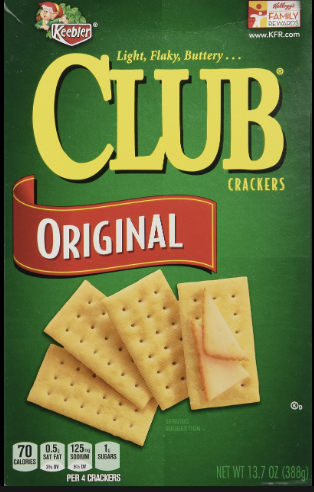
<li>Dark Chocolate</li>
   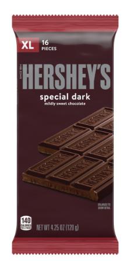
</ul>
<ul> <strong>Meat</strong>
<li>Bacon</li>
   
<li>Steak</li>
   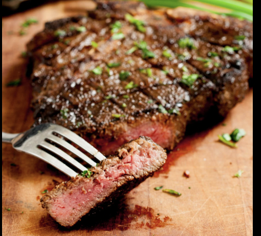
<li>Porkchop</li>
   
<li>Ground Chicken</li>
   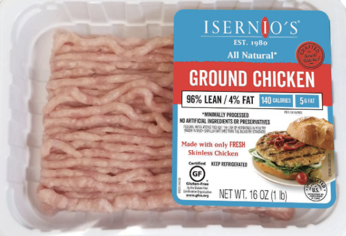
<li>Chicken Breast</li>
   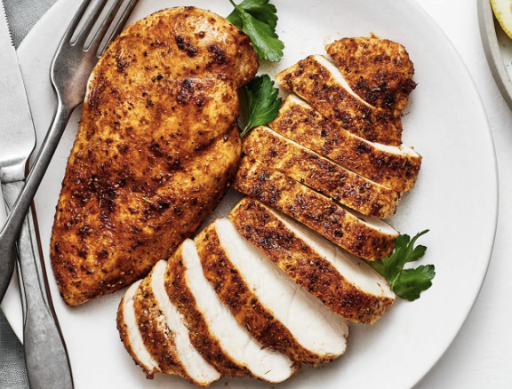
</ul>
<ul> <strong>Craft Supplies</strong>
<li>Paint Brushes</li>
   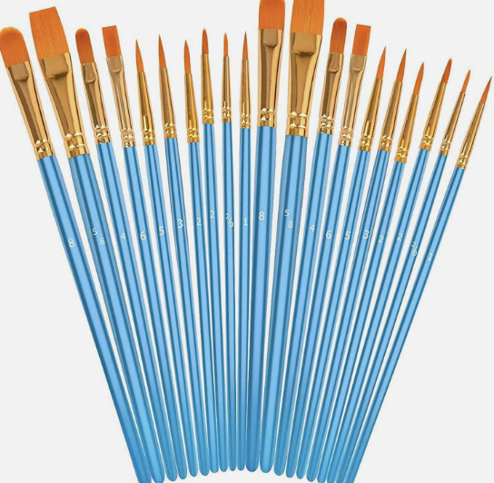
<li>Yarn</li>
   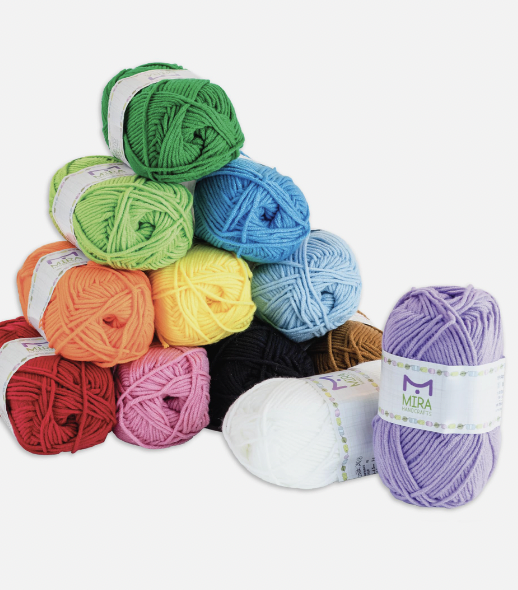
<li>Canvases</li>
   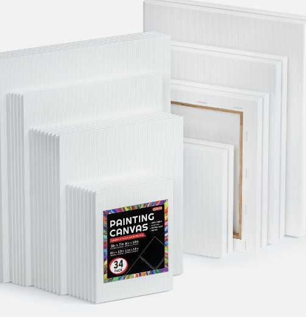
<li>Scissors</li>
   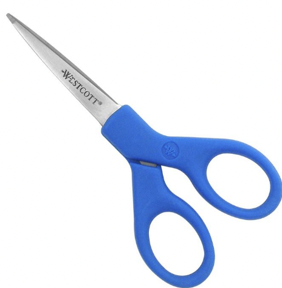
<li>Crayons</li>
   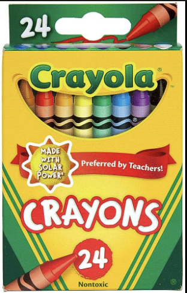
</ul>
<ul> <strong>Beverages</strong>
<li>Coke</li>
   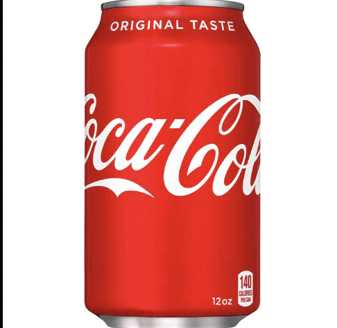
<li>Coffee</li>
   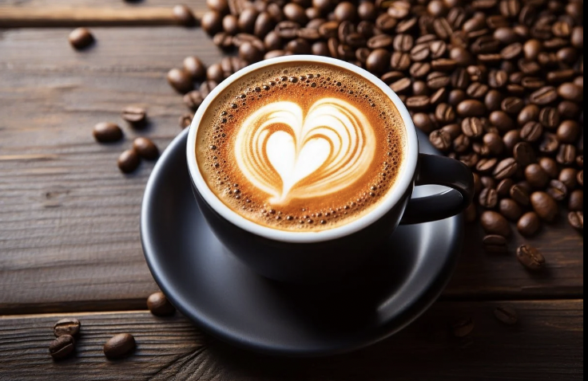
<li> Apple Juice</li>
   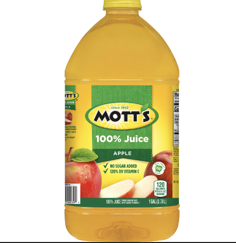
<li>Lemonade</li>
   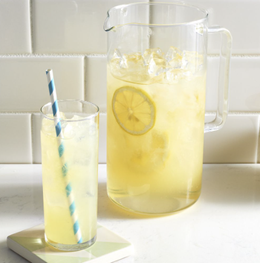
<li>Iced Tea</li>
   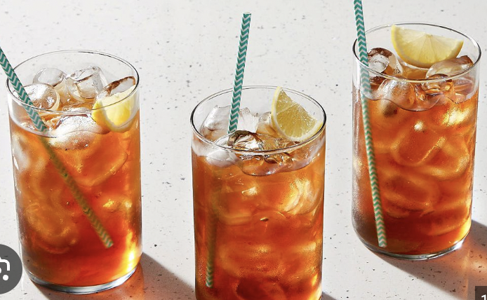
</ul>
